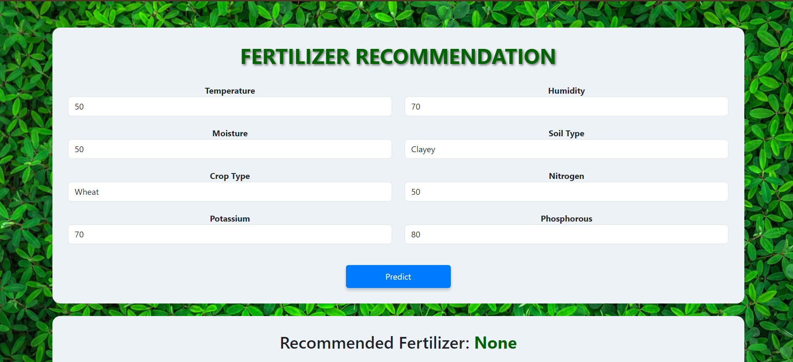

# Fertilizer Recommendation System 🌱💡

## Motivation 💪
Precision agriculture is gaining traction as modern farming techniques increasingly rely on data-driven insights. In addition to determining the right crops to grow, selecting the right fertilizer for specific soil and weather conditions is critical for optimizing yield. Farmers often struggle with deciding which fertilizer will help their crops thrive based on soil nutrients, environmental factors, and specific crop requirements.

To address this need, the **Fertilizer Recommendation System** was designed to assist farmers by recommending the most suitable fertilizers for their crops. This system aims to mitigate the risks of poor fertilization decisions, improve soil health, and maximize crop yields, thereby contributing to sustainable agricultural practices.

## Goal 🎯
To recommend the best fertilizers for crops based on key parameters, assisting farmers in making informed decisions before and during cultivation.

## About the Data 📊
This project utilizes publicly available datasets and combines data such as soil nutrients (Nitrogen, Phosphorus, Potassium levels), soil pH, and weather data like temperature, humidity, and rainfall. The data helps in determining the ideal fertilizer mix for different types of soil and environmental conditions.

The dataset features:
- Soil nutrient levels (N, P, K)
- Soil pH values
- Temperature, humidity, and rainfall for the region

## Technologies Used 💻
- **Python**: Backend programming and machine learning development.
- **Flask**: Micro web framework for the web application.
- **HTML/CSS**: Frontend markup and styling.
- **Bootstrap**: Framework for responsive and mobile-first design.
- **Pandas, NumPy, Scikit-learn**: Data manipulation, analysis, and machine learning.
- **GitHub**: For version control and collaboration.
- **Jupyter Notebook**: Data exploration and model development.

## Project Structure 📁
- **main.py**: Flask application that serves the fertilizer recommendation system.
- **fertilizer_model.pkl**: Pre-trained machine learning model for fertilizer recommendation.
- **templates/**: Folder containing HTML templates.
- **index.html**: Main page of the web application.
- **static/**: Folder for static files like CSS, images, etc.
- **logo.png**: Application logo.
- **background.jpg**: Background image for the web app.
- **<fertilizer_name>.jpg**: Images of the fertilizers for displaying recommendations.
- **README.md**: Documentation file.

## How to Run the Project 🏃‍♂️
1. **Clone the Repository**:
   ```bash
   git clone https://github.com/Abhiram-Laha/fertilizer-recommendation-system.git
   cd fertilizer-recommendation-system
2. **Install Dependencies**:
    ```bash
   pip install -r requirements.txt

3. **Run the Application**:
    ```bash
    python app.py

4. **Open Your Browser**:
  - Navigate to http://127.0.0.1:5000/ to see the application in action.


## Usage 🖥️

1. **Enter the values for Nitrogen, Phosphorous, Potassium, Temperature, Humidity, pH, and Rainfall in the form.**
   
2. **Click on "Get Recommendation".**
   
3. **The recommended crop will be displayed along with an image of the crop.**


## Screenshots 📸




## Video 📹


https://github.com/user-attachments/assets/4528ca27-35f9-4012-8913-d83ee372e6dd


## Contributing 🤝

Contributions are welcome! Feel free to submit issues and enhancement requests. If you'd like to contribute code, please fork the repository and submit a pull request.

## Final Note 🎉

Thank you for exploring our Fertilizer  Recommendation System! We hope it proves useful for farmers and enthusiasts alike. Your feedback and contributions are valuable to us.

Happy farming! 🌱
